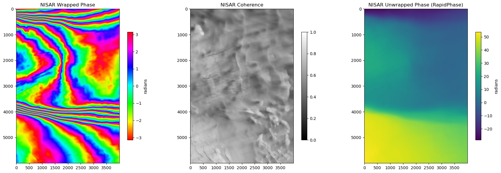
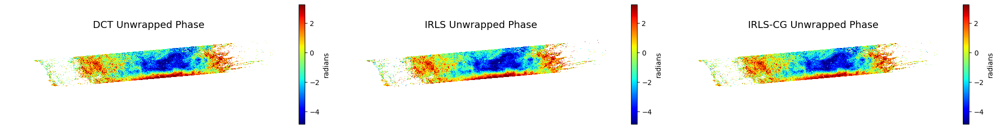

# RapidPhase

**GPU-accelerated phase unwrapping for InSAR processing**

[](https://pypi.org/project/rapidphase/)
[](https://www.python.org/downloads/)
[](https://opensource.org/licenses/MIT)
[](https://pytorch.org/)

RapidPhase provides fast phase unwrapping algorithms optimized for GPU execution (NVIDIA CUDA and Apple Silicon MPS), with automatic CPU fallback. It offers a simple API compatible with [snaphu-py](https://github.com/isce-framework/snaphu-py) while delivering significant speedups on GPU hardware.

## Features

- **GPU Acceleration**: Automatic device selection (CUDA > MPS > CPU)
- **Multi-GPU Support**: Parallel tile processing across multiple NVIDIA GPUs
- **Multiple Algorithms**:
  - **DCT**: Fast unweighted least-squares using Discrete Cosine Transform
  - **IRLS-CG**: DCT-preconditioned Conjugate Gradient with L1-norm approximation and coherence weighting
- **Tiled Processing**: Handle arbitrarily large interferograms (tested on NISAR 66816 x 34128) with automatic tile size scaling, phase-consistent alignment via maximum spanning tree, and cosine-feathered blending
- **Goldstein Filter**: Adaptive frequency-domain filter for noise reduction before unwrapping
- **snaphu-py Compatible**: Drop-in replacement API for easy migration

## Example Results

### NISAR Interferogram Unwrapping

Processing a NISAR interferogram showing wrapped phase and the unwrapped result:



<a href="https://raw.githack.com/smuinsar/rapidphase/main/images/NISAR_interferogram_map.html" target="_blank">View Interactive Map: NISAR Wrapped and Unwrapped Interferogram</a>

### OPERA CSLC Algorithm Comparison

Comparison of DCT, IRLS, and IRLS-CG algorithms on OPERA CSLC data:



## Installation

```bash
pip install rapidphase

# Or install with raster I/O support
pip install "rapidphase[raster]"
```

### Development Installation

```bash
# Clone the repository
git clone https://github.com/smuinsar/rapidphase.git
cd rapidphase

# Install in development mode
pip install -e ".[dev]"
```

### Requirements

- Python >= 3.9
- PyTorch >= 2.0
- NumPy >= 1.20
- SciPy >= 1.7

For GPU acceleration:
- **NVIDIA GPU**: CUDA toolkit and compatible PyTorch
- **Apple Silicon**: macOS 12.3+ with MPS-enabled PyTorch

## Quick Start

```python
import numpy as np
import rapidphase

# Create sample interferogram
y, x = np.ogrid[-3:3:512j, -3:3:512j]
igram = np.exp(1j * np.pi * (x + y))
corr = np.ones(igram.shape, dtype=np.float32)

# Unwrap with automatic GPU detection
unw, conncomp = rapidphase.unwrap(igram, corr, nlooks=1.0)

# Check available devices
print(rapidphase.get_available_devices())
# {'cpu': True, 'cuda': True, 'mps': False, 'cuda_devices': [...]}
```

## API Reference

### Phase Unwrapping

```python
unw, conncomp = rapidphase.unwrap(
    igram,                    # Complex interferogram or wrapped phase
    corr=None,                # Coherence map (optional), values in [0, 1]
    nlooks=1.0,               # Number of looks for weight conversion
    algorithm="auto",         # "dct", "irls_cg", or "auto"
    device="auto",            # "cuda", "mps", "cpu", or "auto"
    ntiles=None,              # Tile grid, e.g., (4, 4). Auto-scaled for large images
    tile_overlap=None,        # Overlap in pixels (default: 10% of tile size)
    n_gpus=None,              # Number of GPUs (default: all available)
    verbose=False,            # Print tile alignment details
)
```

When `ntiles` is specified, tiles are automatically enlarged if they exceed ~80M pixels per tile to ensure solver reliability. Tile overlaps are aligned using a maximum spanning tree that prioritizes high-confidence paths, then blended with cosine-feathered weights.

### Convenience Functions

```python
# Fast DCT (no coherence weighting)
unw, conncomp = rapidphase.unwrap_dct(igram)

# IRLS-CG (coherence-weighted, L1 approximation, robust to outliers)
unw, conncomp = rapidphase.unwrap_irls_cg(igram, corr, nlooks=5.0)
```

### Goldstein Adaptive Filter

```python
# Apply Goldstein filter to reduce noise before unwrapping
igram_filtered = rapidphase.goldstein_filter(
    igram,              # Complex interferogram
    alpha=0.6,          # Filter strength (0.2-1.0, higher = stronger)
    window_size=64,     # FFT window size in pixels
    overlap=0.75,       # Window overlap fraction
    device="auto",      # "cuda", "mps", "cpu", or "auto"
    ntiles="auto",      # Tile grid (auto-scaled for large images)
)

# Then unwrap the filtered interferogram
unw, conncomp = rapidphase.unwrap(igram_filtered, corr, nlooks=5.0)
```

### Tiled Processing for Large Images

For very large interferograms (e.g., NISAR at 66816 x 34128 pixels), tiled processing keeps GPU memory usage manageable:

```python
unw, conncomp = rapidphase.unwrap(
    igram_large,
    corr_large,
    nlooks=10.0,
    ntiles=(4, 4),          # Auto-scaled if tiles are too large
    n_gpus=4,               # Use 4 GPUs in parallel
    verbose=True,           # Monitor tile alignment progress
)
```

### GPU Memory Management

When combining RapidPhase with other GPU frameworks (e.g., CuPy), clear caches between frameworks:

```python
rapidphase.clear_gpu_cache()
```

### When to Use Each Algorithm

- **DCT**: Best for clean data with high coherence. Fastest option.
- **IRLS-CG**: Better for noisy data with low coherence. Uses coherence weighting and approximates L1-norm for robustness to outliers.

## Examples

See the [examples/](examples/) directory for Jupyter notebooks demonstrating:

- Phase unwrapping with DCT and IRLS-CG algorithms
- Tiled processing for large images
- Goldstein adaptive filtering
- NISAR and OPERA CSLC interferogram processing

## Performance

RapidPhase achieves significant speedups over CPU-based SNAPHU:

| Image Size | RapidPhase (GPU) | SNAPHU (CPU) | Speedup |
|------------|-----------------|--------------|---------|
| 256×256 | ~0.02s | ~0.15s | ~7× |
| 512×512 | ~0.03s | ~0.6s | ~20× |
| 1024×1024 | ~0.1s | ~2.5s | ~25× |

*Benchmarks on NVIDIA RTX 3090. Actual performance varies by hardware.*

## Project Structure

```
rapidphase/
├── src/rapidphase/
│   ├── api.py            # Public API (unwrap, goldstein_filter)
│   ├── core/             # Unwrapping algorithms
│   │   ├── dct_solver.py       # DCT least-squares solver
│   │   └── irls_cg_solver.py   # IRLS with DCT-preconditioned CG
│   ├── device/           # GPU/CPU device management
│   ├── filtering/        # Goldstein adaptive filter
│   ├── tiling/           # Tile processing, alignment, blending
│   ├── utils/            # Phase operations, quality metrics
│   └── io/               # Raster I/O (optional)
├── tests/                # Unit tests
├── examples/             # Jupyter notebooks
└── npy/                  # Sample data (NISAR)
```

## Development

```bash
# Install dev dependencies
pip install -e ".[dev]"

# Run tests
pytest

# Run tests with coverage
pytest --cov=rapidphase
```

## License

MIT License - see [LICENSE](LICENSE) for details.

## Citation

If you use RapidPhase in your research, please cite:

```bibtex
@software{rapidphase,
  title = {RapidPhase: GPU-accelerated phase unwrapping},
  url = {https://github.com/smuinsar/rapidphase/tree/main/},
  year = {2026},
}

@article{DuboisTaine2024,
  title={Iteratively Reweighted Least Squares for Phase Unwrapping},
  author={Dubois-Taine, Benjamin and Akiki, Roland and d'Aspremont, Alexandre},
  journal={arXiv preprint arXiv:2401.09961},
  year={2024},
  doi={10.48550/arXiv.2401.09961}
}
```

## Acknowledgments

- The IRLS-CG algorithm is based on [Dubois-Taine et al. (2024)](https://doi.org/10.48550/arXiv.2401.09961)
- Algorithm implementations inspired by [SNAPHU](https://web.stanford.edu/group/radar/softwareandlinks/sw/snaphu/) and related literature
- Built with [PyTorch](https://pytorch.org/) for GPU acceleration

## Author

**Jinwoo Kim**: [jinwook@smu.edu](mailto:jinwook@smu.edu)
